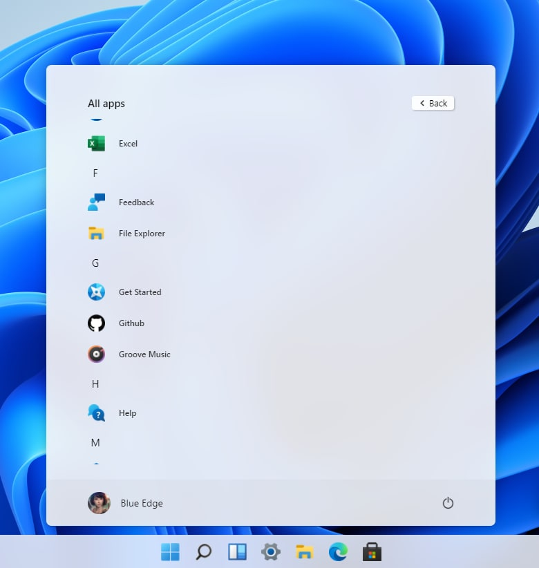
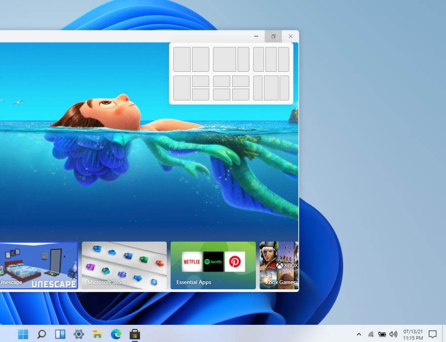

Hello devs,

So this is a windows 11 clone that I made in React in the span of 7 days. Would you like to check out? I bet you wont be able to tell the difference in full screen mode.

Website: [win11.blueedge.me](https://win11.blueedge.me/)  
Github: [blueedgetechno/win11React](https://github.com/blueedgetechno/win11React)

<!--truncate-->

And this is just the tip of the iceberg, visit: [win11.blueedge.me](https://win11.blueedge.me/)
