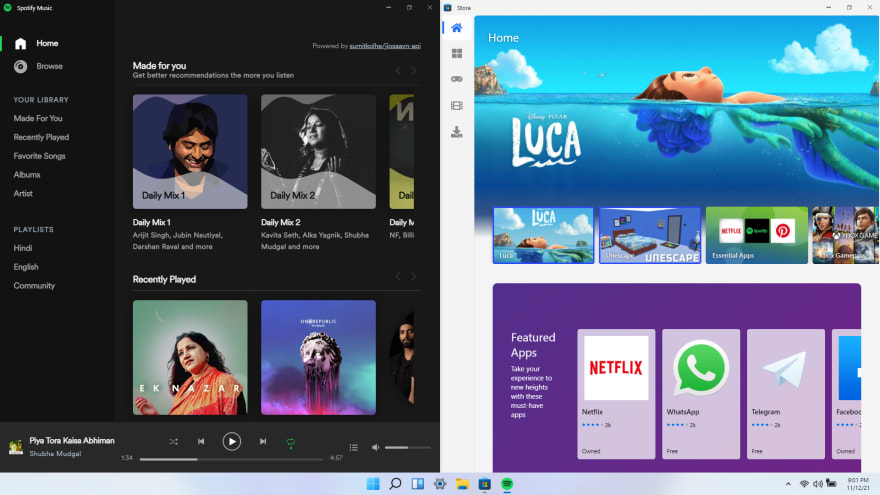
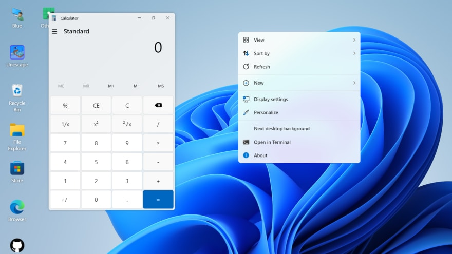

Hello devs,

So this is a follow up of my previous post about the remaking of windows 11 in ReactJs.

Visit: [win11.blueedge.me](https://win11.blueedge.me/)  
Github: [blueedgetechno/win11React](https://github.com/blueedgetechno/win11React)  
Discord: [discord.gg/qmEZwUhb4b](https://discord.gg/qmEZwUhb4b)

<!--truncate-->

After a few months of regular updates and huge support from the community, we have been able to add dozens of features and lots of enhancements.

This version presents you:

1. Dark mode and ton of CSS optimizations.
2. A fully featured and community-backed store system to download external applications.
3. New apps like Spotify, Discord, Camera, Store (updated), and a lot more.
4. Native features like Context menu, Action center, Lockscreen, Boot Screen.
5. A lot more responsive for mobile and tablets.

And a lot more on my bucket list ...

## Preview

Of course, There were a lot of hiccups during the development of this project. We even faced a backlash from Microsoft for trademark violation but we managed our way through.

Special thanks to [@andrewstech](https://github.com/andrewstech) for being so helpful during the entire process.

Visit: [win11.blueedge.me](https://win11.blueedge.me/)  
Github: [blueedgetechno/win11React](https://github.com/blueedgetechno/win11React)  
Discord: [discord.gg/qmEZwUhb4b](https://discord.gg/qmEZwUhb4b)
